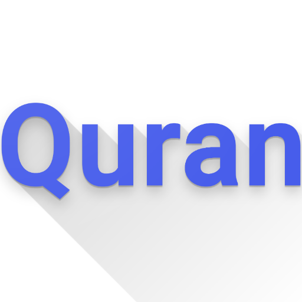
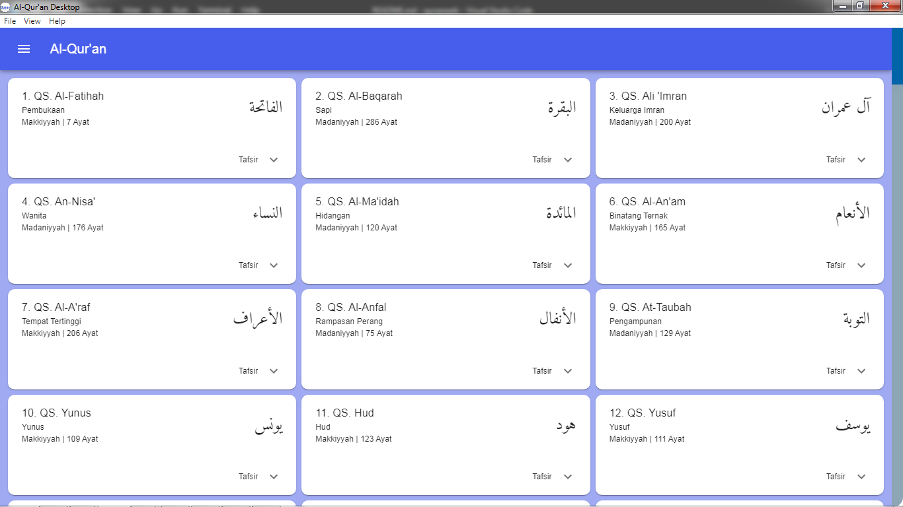

# Qur'an Desktop 

    

## Contents

- [Description](#description)
- [Features](#features)
- [Requirements](#requirements-for-development)
- [Installation](#installation-for-development)
- [Screenshots](#screenshots)
- [API Source](#api-source)
- [Demo](#demo)

## Description

Desktop app for reading the Holy Quran. It can also be used to listen to verse by verse and copy verse the Quran. This project is built with electron framework and use [
electron-react-boilerplate](https://github.com/electron-react-boilerplate/electron-react-boilerplate).

## Features

- [x] Read, listen, and copy verses of al-Quran

## Requirements for Development

- [`Node Js`](https://nodejs.org/en/)
- [`yarn`](https://yarnpkg.com/)
- [`ReactJs`](https://reactjs.org/)
- [`Electron`](https://www.electronjs.org/)

## Installation for Development

1. Open your terminal or command prompt
2. Type `git clone https://github.com/solehudin5699/QuranDesktop.git`
3. Open the folder and type `yarn install` for install dependencies
4. Type `yarn start` in terminal for running this project.
5. Type `yarn run build` to build.
5. Type `yarn run package` to package this project.

## Screenshots

    

## API Source

- [`api.quran.sutanlab.id`](https://github.com/sutanlab/quran-api)

## Demo

Download and install in desktop : 

